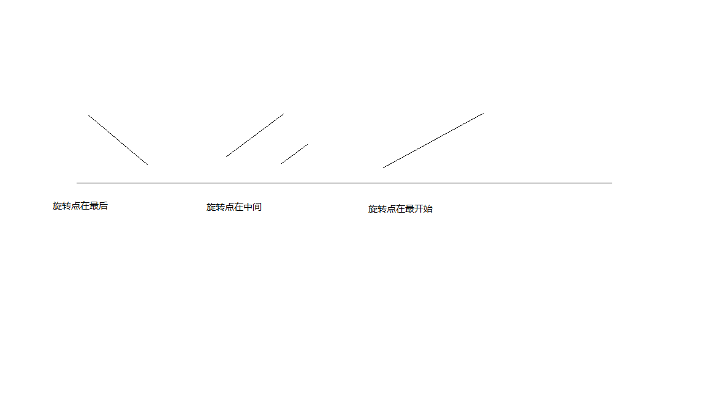

假设按照升序排序的数组在预先未知的某个点上进行了旋转。

( 例如，数组 [0,1,2,4,5,6,7] 可能变为 [4,5,6,7,0,1,2] )。

请找出其中最小的元素。

你可以假设数组中不存在重复元素。

### 示例 1:
输入: [3,4,5,1,2]
输出: 1
### 示例 2:
输入: [4,5,6,7,0,1,2]
输出: 0

### 解法；
可以看上面的图，是旋转过后存在的三种情况，只需要判断中点的左右的值的大小，就知道那一边是连续升序，然后就直接寻找最左侧最小值和上一次的最小值比较，就可以找到最小的值了